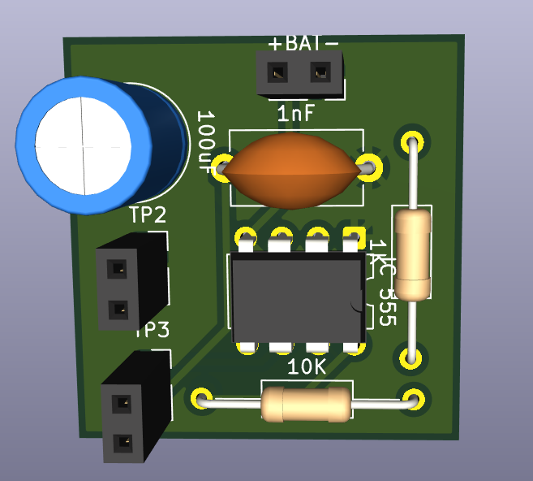
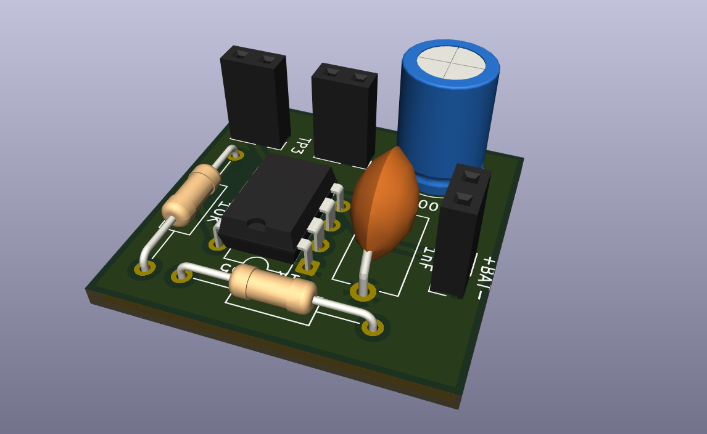
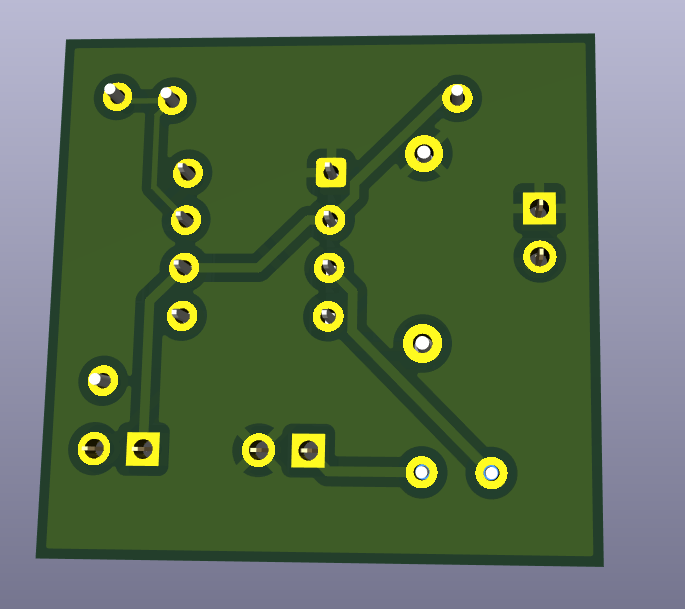

# 🎵 STEM Toy PCB Design Using 555 Timer (KiCad)

📌 Project Overview

This project is a STEM Toy PCB designed using KiCad, based on a 555 Timer IC in astable mode.  
The circuit generates an audible tone using a buzzer and operates from a 3.2V power supply, making it suitable for low-power educational toys. This project helps beginners understand oscillators, RC timing, and PCB design.

---

## 🧠 Learning Objectives

- Understand 555 timer astable operation  
- Learn schematic → PCB → 3D view workflow in KiCad  
- Basic component placement & routing  
- Generate Gerber-ready PCB

---

## 🧩 Components Used

- Timer IC: 555 Timer  
- Resistor R1: 1 kΩ  
- Resistor R2: 10 kΩ  
- Capacitor C1: 1 µF  
- Capacitor C2: 100 uF  
- Buzzer: Active Buzzer  
- Power Supply: 3.2 V DC

---

## ⚙️ Working Principle

The 555 timer is configured in astable mode, continuously generating pulses. The resistors (1 kΩ and 10 kΩ) and the 1 µF capacitor set the oscillation frequency. The output (Pin 3) drives the buzzer to produce sound. The 100 uF capacitor improves noise stability. Powered from a 3.2 V battery for low-power operation.

---

## 🛠️ Design Tool

EDA Tool: KiCad

Design includes:
- Schematic design
- PCB layout
- 3D PCB visualization
- Single-layer PCB routing (or as designed)

---

## 🖼️ PCB Design Images

### 🔹 3D PCB View


### 🔹 PCB Top View


### 🔹 PCB Bottom View


---

## 📂 Repository Structure

STEM-Toy-555-Timer/  
│── Schematic/  
│   └── stem_toy_555.kicad_sch  
│── PCB/  
│   └── stem_toy_555.kicad_pcb  
│── Images/  
│   ├── image_1.png        ← 3D PCB view (rename to pcb_3d_view.png if desired)  
│   ├── image_2.png        ← PCB top view (rename to pcb_top_view.png if desired)  
│   └── image_3.png        ← PCB bottom view (rename to pcb_bottom_view.png if desired)  
│── README.md

Notes:
- Place your PNG files inside the Images/ folder.
- Use simple, lowercase names with no spaces. Example preferred names: pcb_3d_view.png, pcb_top_view.png, pcb_bottom_view.png

---

## 🔌 Power Requirements

- Input Voltage: 3.2 V DC  
- Battery powered, low current consumption

---

## 🎯 Applications

- STEM education kits  
- Beginner electronics learning  
- Sound-based toys  
- PCB design practice projects

---

## 🚀 Future Improvements

- Add LED indicator  
- Add potentiometer for tone control  
- Enclosure design for toy  
- Battery protection circuit

---

## 🔧 How to Export Images from KiCad (Quick)

1. Open your `.kicad_pcb`.  
2. View → 3D Viewer → File → Export → PNG → save as `image_1.png` (or `pcb_3d_view.png`).  
3. File → Plot → PNG → select Top Copper → save as `image_2.png` (or `pcb_top_view.png`).  
4. Repeat for Bottom Copper → save as `image_3.png` (or `pcb_bottom_view.png`).  
5. Create an `Images/` folder in your repo and move the PNG files there.  
6. Commit and push; GitHub will render them in this README.

Quick test (must work): If this README contains:
```

```
and `Images/image_1.png` exists in the repo, GitHub will display it.

---

## ⚠️ Common Mistakes (avoid)

- Wrong folder name (must be `Images`, not `images` or other)  
- Image not committed/pushed  
- Spaces in image file name  
- Wrong capitalization

---

## 👩‍💻 Author

Jenna  
Embedded Systems & PCB Design Enthusiast — KiCad | Embedded Systems | STEM Projects

---

## 📜 License

MIT — adapt and reuse freely. Please retain attribution when sharing.
